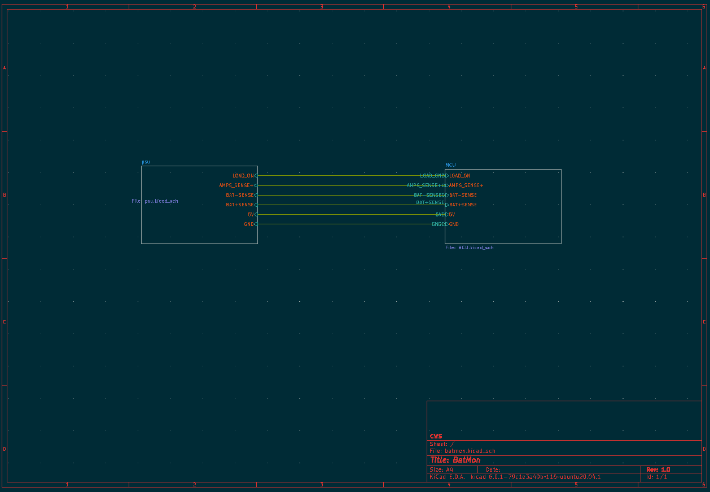
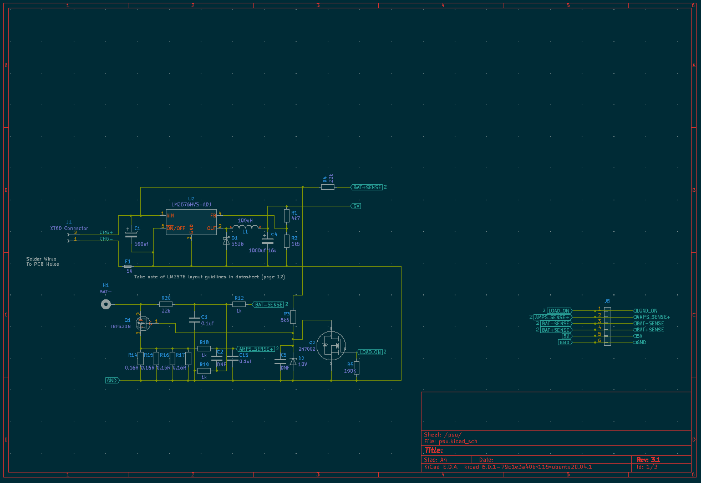
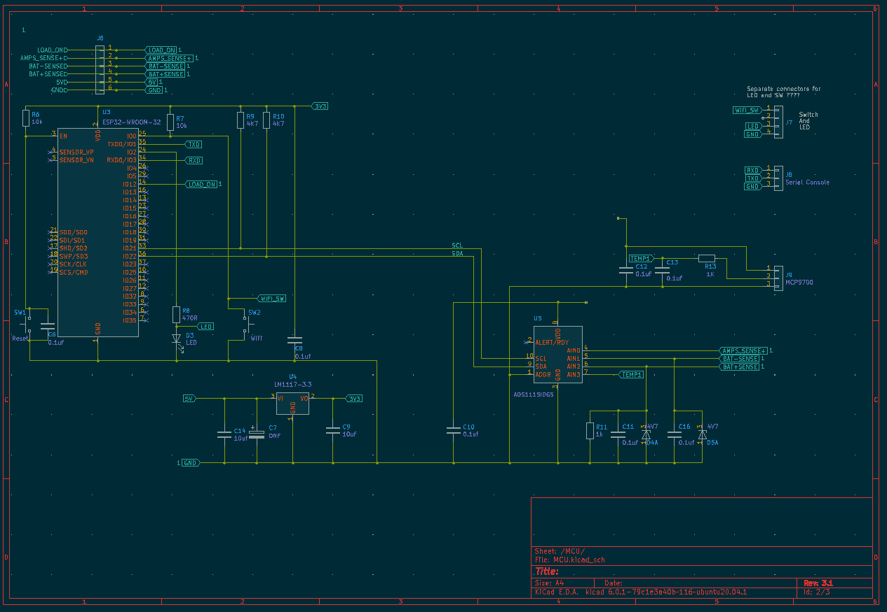
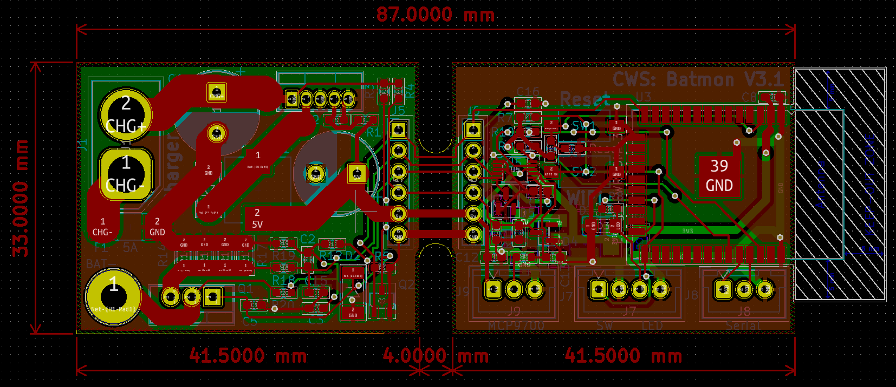
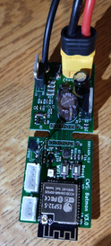
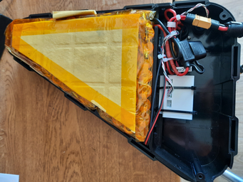
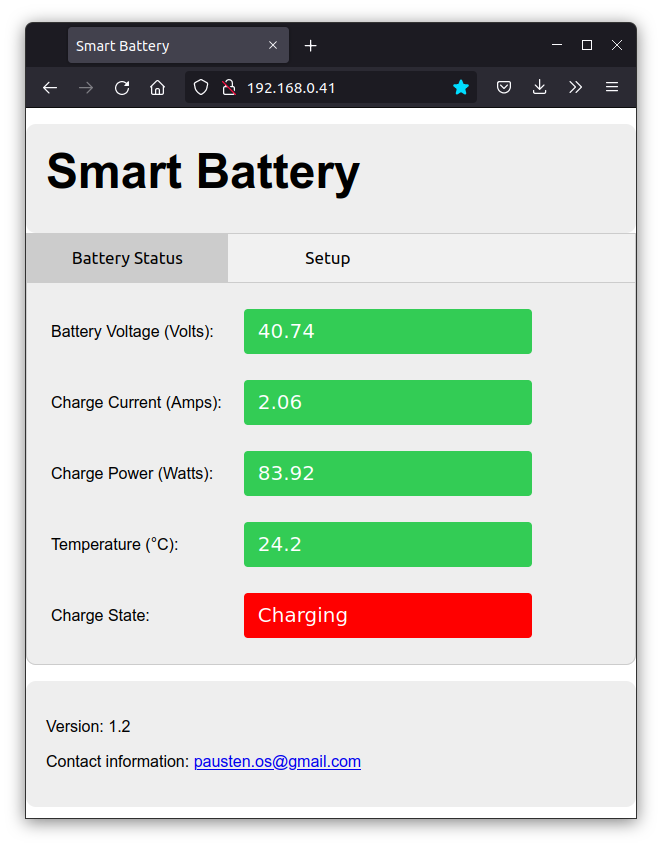
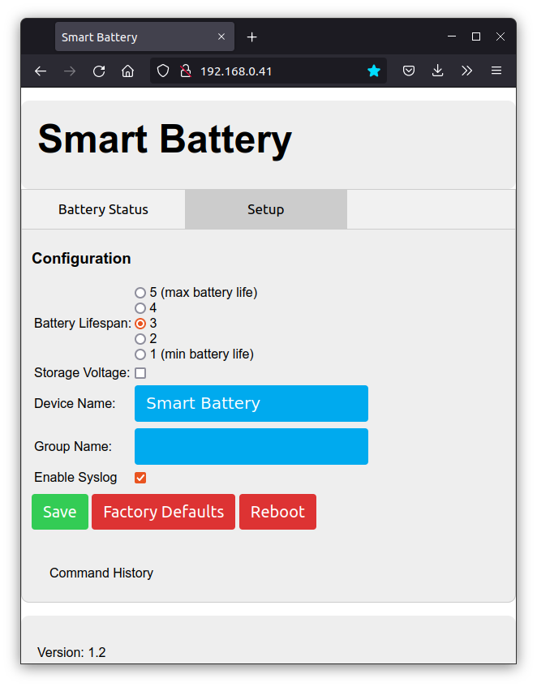

# BATMON

## Overview
The batmon device connects to a Lithium ION battery (primarily aimed at Ebike batteries) and allows the user to
trade off the lifetime of the battery against the maximum single charge. The life of a lithium ION cell
is affected by many things, the maximum charge level of the cell, the temperature of the cell, the maximum
discharge of the cell etc. The batmon device allows the user to limit the maximum charge voltage of the cell
to reduce stresses on the battery chemistry.

For example if the maximum charge voltage of a Lithium ION cell is set to 4.1
volts per cell rather than the maximum of 4.2 volts per cell then the number of charge/discharge cycles
that the battery is capable of could be doubled. The trade off for this is that you will loose about 10 %
of the range on a single charge. If set to 4.0 volts per cell then the number of charge/discharge cycles
that the battery is capable of could be increased by four times. The trade off for this is that you will
loose about 25 % of the range on a single charge. The batmon device allows the user to set this trade off
by selecting the maximum charge voltage in five 0.05 volt steps from 4.2 to 4.0 volts.

The device also ensures that the battery is not charged when to cold or hot which also limit the batteries
lifetime. Charging at temperatures of 0°C or below can also be dangerous.

As stated previously this project is primarily aimed at improving the lifetime of Ebike batteries although the hardware could be used for other batter voltages with slight tweaks to the software. The device provides a WiFi connection. This can connect to your home WiFi network or run in stand alone (AP) mode. The [Yview App](https://github.com/pjaos/yview/tree/master/gui) can be used (Android phone/tablet or a Windows, Linux PC) to access the state of the battery (charge voltage/current etc).

## System Requirements
An initial set of requirements for the system is shown below.

* Charge the battery to a maximum voltage of between 4.0 and 4.2 Volts, configurable by the user.
* Display the charge voltage, current and power.
* Turn off charging if the battery temperature is too cold (<= 0°C).
* Turn off charging if the battery temperature is too hot (> 45°C)g.

## Hardware.
The hardware design uses an ESP32 CPU which provides the WiFi connectivity. An ADS1115 I2C 16 bit ADC device is used to measure the battery voltage, charge current and battery temperature. A Mosfet is used to turn off the battery charge once it reaches the configured charge voltage. The case for the module was 3D printed to provide a robust mount for the module inside the battery case.

 
")
")
")
")
")

## Software
The software that runs on the device is written in C and uses the [Mongoose OS](https://mongoose-os.com/).
It provides a web interface and integrates with the [YView](https://github.com/pjaos/yview) Iot archetecture.
The web interface is shown below.

The configuration page allow the user to trade off battery charge level against
the longevity of the battery pack via the 5 radio buttons at the top of the page.
 * 5 = max battery life but only charges the battery pack to 4 volts per cell.
 * 1 = min battery life but charges the battery pack to 4.2 volts per cell.

 The default is 3 with charges the battery pack to 4.1 volts per cell. This
 setting should approximately double the life (number of charge discharge cycles) when
 compared option 1. EBike battery chargers will normally charge a battery pack to this level. If option 5 is selected then the life of the battery should be approximately 4 times longer when compared to option 1.

The storage voltage checkbox can be selected if the user wishes to store the ebike for some time (E.G through the winter) and maximise the battery performance. This charges the battery to 3.7 volts.

The Device name can be set which sets the name that the device will appear as in the YView Iot network.

The group name can be set if the user wishes to partition the Iot network such that some users can see some devices.

The Enable syslog option is used for debugging and sends debugging information via the syslog protocol to the server running the YView Iot gateway process.

The save button will apply the configuration selected. The other buttons names are self explanatory.
